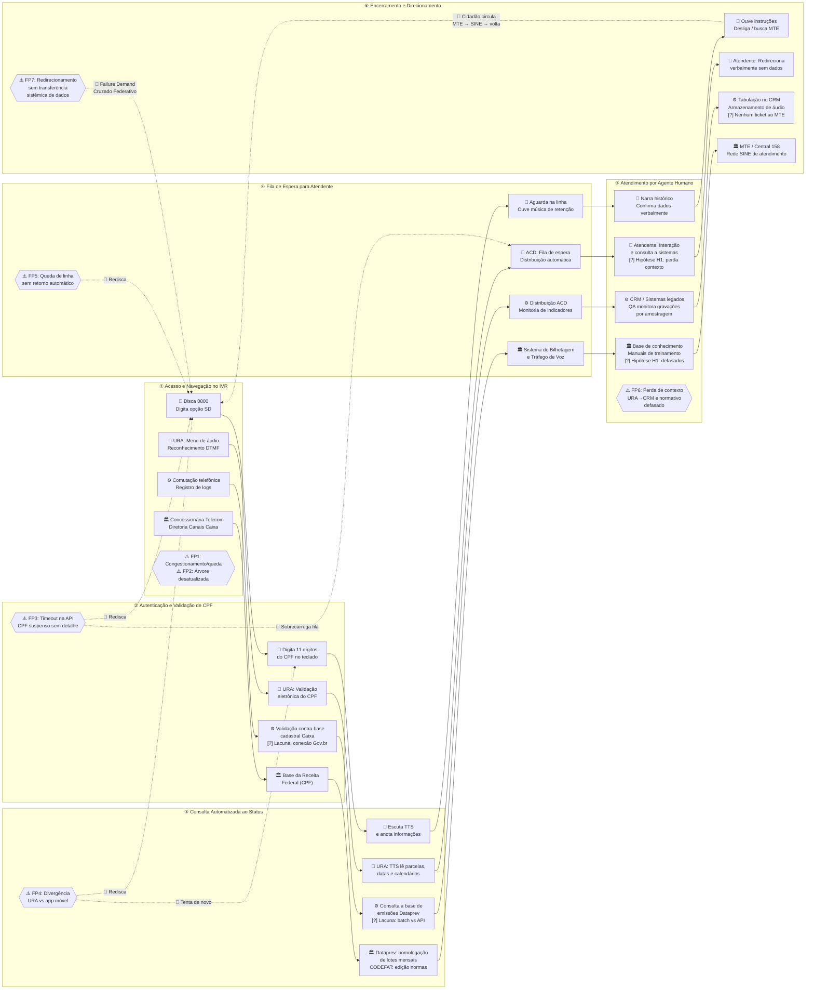

# D_diagrama_asis.md — Diagrama de Relações AS-IS

## Atendimento ao Seguro-Desemprego pela URA da Caixa Econômica Federal

Diagrama de relações entre etapas e atores, derivado do Service Blueprint (C_blueprint_asis.md).

## Legenda

| Ícone | Significado |
|---|---|
| 🧑 | Ações do Cidadão — acima da Linha de Interação |
| 🤖 | Frontstage — visível ao cidadão (URA, ACD, Atendente) |
| ⚙️ | Backstage — invisível ao cidadão (sistemas, logs, QA) |
| 🏛️ | Processos de Suporte — terceiros, órgãos externos |
| ⚠️ FPn | Failure point identificado |
| [?] Lacuna / Hipótese | Processo existente sem documentação pública ou pendente de validação |
| 🔁 | Failure demand loop — retroalimentação que gera rediscagens |
| ---> | Fluxo principal do atendimento (etapas sequenciais) |
| -.->
